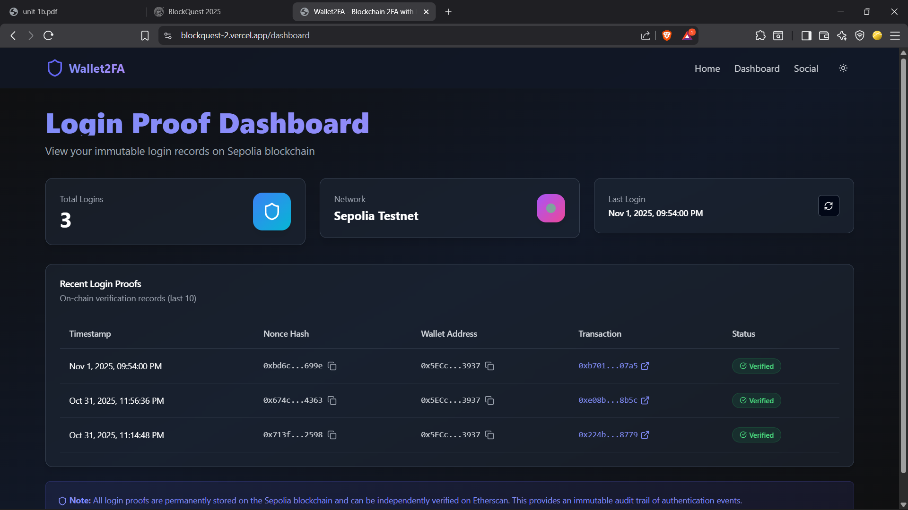
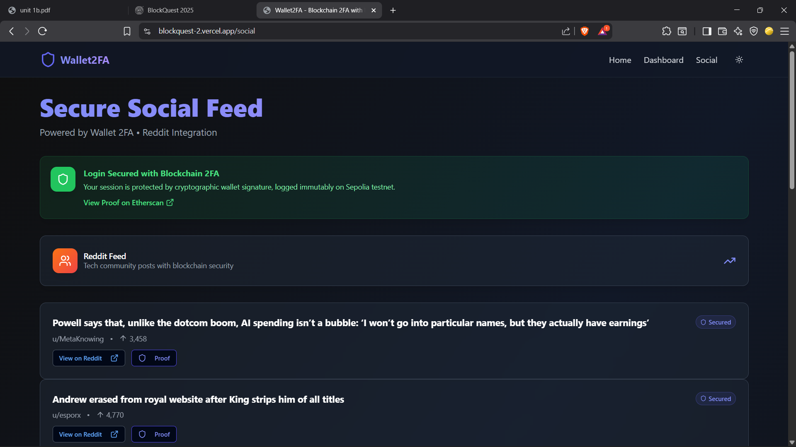
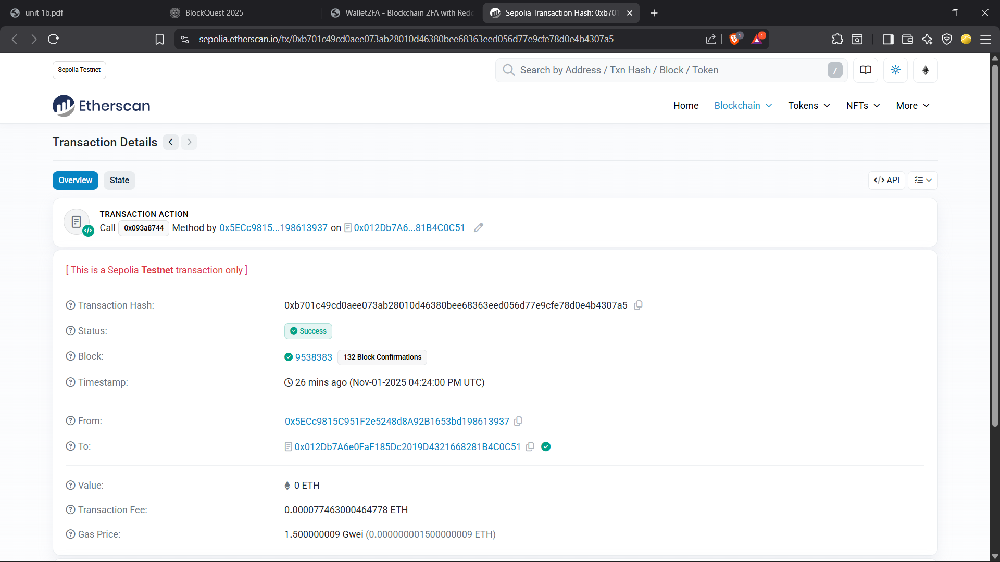

# Wallet-Based 2FA - BlockQuest 2025


## 🚀 Overview

**Wallet-Based 2FA** revolutionizes authentication by replacing traditional SMS/email 2FA with **crypto wallet signatures**. Built for BlockQuest 2025 hackathon (Q9: Wallet-Based 2FA), this project combines Firebase authentication with MetaMask wallet signatures and Solidity smart contracts on Sepolia testnet to create an immutable, phishing-resistant login system.

### 🎯 Key Features

- **🔐 Phishing Resistant**: Cryptographic signatures prevent phishing attacks
- **⛓️ Immutable Audit Trail**: Every login logged on Sepolia blockchain
- **🚫 No SMS Required**: Wallet-based 2FA eliminates SMS vulnerabilities
- **✅ Easy Integration**: Simple email/password → wallet signature flow
- **🔍 Transparent Verification**: All proofs verifiable on Etherscan

---

## 🏗️ Architecture

```
┌─────────────────┐
│  User Login     │ Email/Password (Firebase)
└────────┬────────┘
         │
         ▼
┌─────────────────┐
│  Nonce Gen      │ Server generates unique challenge
└────────┬────────┘
         │
         ▼
┌─────────────────┐
│  MetaMask Sign  │ User signs nonce with wallet
└────────┬────────┘
         │
         ▼
┌─────────────────┐
│  Verification   │ Server verifies signature
└────────┬────────┘
         │
         ▼
┌─────────────────┐
│  On-Chain Log   │ Log proof to Sepolia smart contract
└────────┬────────┘
         │
         ▼
┌─────────────────┐
│  Dashboard      │ View immutable login history
└─────────────────┘
```

---

## 🛠️ Tech Stack

| Category | Technology |
|----------|------------|
| **Frontend** | Next.js 14.2.3, React 18, TypeScript 5.5+ |
| **Styling** | Tailwind CSS 3.4+, shadcn/ui components |
| **Auth** | Firebase Authentication 10.13+ |
| **Blockchain** | Ethers.js 6.13.2, Solidity 0.8.24, Sepolia Testnet |
| **Wallet** | MetaMask (via window.ethereum) |
| **Crypto** | CryptoJS 4.2.0 (SHA256, random nonces) |
| **Utilities** | date-fns, react-hot-toast, js-cookie |

---

## 📋 Prerequisites

Before you begin, ensure you have:

- **Node.js 20+** and **Yarn 1.22+**
- **MetaMask browser extension** installed
- **Sepolia test ETH** (get from [Sepolia Faucet](https://sepoliafaucet.com))
- **Firebase project** (free tier)
- **Infura or Alchemy API key** for Sepolia RPC

---

## 🪙 Blockchain Integration
> “The credentials provided to the wallet are for testing purposes only. No one can withdraw or use the test Ethereum for personal use.”
To use this app:
1. Install the **MetaMask browser extension**.
2. Open the extension.
3. Connect the **Test MetaMask wallet** with the credentials provided below.
4. Create a password to access wallet on your device.
5. Click on the hamburger icon in top right corner and select **Networks**.
6. Click on **Show test networks** and click on the three dots next to **Sepolia**.
7. Add the **RPC URL** as provided below.
8. Click on Save.

---

## Test Credentials

| Name | Value |
|---------|-------------|
| `Secret recovery phase for wallet` | dragon call decorate picture vital worry whale still update sentence syrup march |
| `RPC URL` | https://sepolia.infura.io/v3/f4f7ccc8d8a9467e8d04526b177ecc7f |

---

## ⚡ Quick Start

### 1. Clone Repository

```bash
git clone https://github.com/yourusername/wallet-2fa-blockquest.git
cd wallet-2fa-blockquest
```

### 2. Install Dependencies

```bash
yarn install
```

### 3. Environment Setup

Create `.env` file in the root directory:

```bash
# Firebase Configuration
NEXT_PUBLIC_FIREBASE_API_KEY=your_firebase_api_key
NEXT_PUBLIC_FIREBASE_AUTH_DOMAIN=your_project.firebaseapp.com
NEXT_PUBLIC_FIREBASE_PROJECT_ID=your_project_id
NEXT_PUBLIC_FIREBASE_STORAGE_BUCKET=your_project.appspot.com
NEXT_PUBLIC_FIREBASE_MESSAGING_SENDER_ID=your_sender_id
NEXT_PUBLIC_FIREBASE_APP_ID=your_app_id
NEXT_PUBLIC_FIREBASE_MEASUREMENT_ID=your_measurement_id

# Blockchain Configuration
NEXT_PUBLIC_SEPOLIA_RPC=https://sepolia.infura.io/v3/YOUR_INFURA_KEY
NEXT_PUBLIC_CHAIN_ID=11155111

# Smart Contract (update after deployment)
NEXT_PUBLIC_CONTRACT_ADDRESS=0xYourContractAddress
NEXT_PUBLIC_CONTRACT_ABI=[...]  # Paste full ABI JSON
```

### 4. Deploy Smart Contract

Follow instructions in [`DEPLOYMENT_INSTRUCTIONS.md`](./DEPLOYMENT_INSTRUCTIONS.md):

1. Open [Remix IDE](https://remix.ethereum.org)
2. Create `Wallet2FA.sol` from [`contracts/Wallet2FA.sol`](./contracts/Wallet2FA.sol)
3. Compile with Solidity 0.8.24
4. Deploy to Sepolia testnet via MetaMask
5. Copy contract address and ABI to `.env`

### 5. Run Development Server

```bash
yarn dev
```

Open [http://localhost:3000](http://localhost:3000)

---

## 🧪 Testing

### Manual Testing Flow

1. **Landing Page** (`/`): Verify UI loads correctly
2. **Login** (`/login`):
   - Create new account with email/password
   - Verify password validation (8+ chars, special chars)
3. **2FA Challenge** (`/2fa`):
   - Check nonce is displayed
   - Connect MetaMask wallet
   - Switch to Sepolia network
   - Sign nonce message
   - Verify signature
   - Confirm on-chain transaction
4. **Dashboard** (`/dashboard`):
   - View login proofs table
   - Click Etherscan links to verify
   - Copy nonce hashes/tx hashes
   - Test logout

### API Testing

```bash
# Test nonce generation
curl -X POST http://localhost:3000/api/auth/nonce \
  -H "Content-Type: application/json" \
  -d '{"userId":"test123","email":"test@example.com"}'

# Test signature verification
curl -X POST http://localhost:3000/api/verify-signature \
  -H "Content-Type: application/json" \
  -d '{
    "signature":"0x...",
    "nonce":"abc123...",
    "nonceHash":"def456...",
    "walletAddress":"0x...",
    "userId":"test123",
    "email":"test@example.com"
  }'
```

---

## 📁 Project Structure

```
/app
├── app/
│   ├── page.tsx                   # Landing page
│   ├── login/page.tsx             # Email/password login
│   ├── 2fa/page.tsx               # Wallet signature challenge
│   ├── dashboard/page.tsx         # Login proofs dashboard
│   ├── layout.tsx                 # Root layout with providers
│   └── api/
│       ├── auth/nonce/route.ts    # Nonce generation API
│       └── verify-signature/route.ts  # Signature verification API
├── lib/
│   ├── firebase.ts                # Firebase config & auth
│   ├── ethers.ts                  # Ethers.js utilities
│   └── utils.ts                   # Crypto & formatting utils
├── hooks/
│   ├── useAuth.ts                 # Firebase auth hook
│   └── useWallet.ts               # MetaMask connection hook
├── contracts/
│   └── Wallet2FA.sol              # Solidity smart contract
├── components/ui/                 # shadcn/ui components
├── .env                           # Environment variables
└── package.json                   # Dependencies
```

---

## 🔒 Security Features

### Phishing Resistance
- Private keys never leave MetaMask
- Signature verification proves wallet ownership
- No vulnerable SMS/email codes

### Single-Use Nonces
- Each nonce expires in 5 minutes
- Server validates nonce hasn't been reused
- SHA256 hashing for tamper detection

### Rate Limiting
- Max 5 verification attempts per minute per user
- Prevents brute-force attacks

### On-Chain Immutability
- Smart contract prevents duplicate nonce logging
- Events queryable for audit trails
- Gas-efficient (~30k per log)

---

## 🎓 How It Works

### 1. Firebase Authentication
User signs in with email/password. Server generates a random 32-byte nonce and SHA256 hash stored in session with 5-minute expiry.

### 2. MetaMask Wallet Connection
Frontend prompts MetaMask connection, switches to Sepolia network (chain ID: `0xaa36a7`), displays wallet address.

### 3. Signature Challenge
User signs nonce message with `personal_sign` in MetaMask. Signature proves control of private key without revealing it.

### 4. Server-Side Verification
Backend uses `ethers.verifyMessage()` to recover signer address. Checks:
- Signature valid
- Recovered address matches wallet
- Nonce not expired or reused

### 5. On-Chain Logging
Successful verification triggers smart contract `logProof(bytes32 nonceHash)` transaction. Event emitted with:
- `nonceHash` (indexed)
- `user` address (indexed)
- `timestamp` (block.timestamp)

### 6. Dashboard Display
Frontend queries `LoginProof` events from contract, displays in table with Etherscan links.

---

## 🌐 Smart Contract

**Contract Address**: [View on Sepolia Etherscan](https://sepolia.etherscan.io/address/YOUR_CONTRACT)

### Functions

```solidity
function logProof(bytes32 nonceHash) external
// Logs a successful login proof on-chain
// Reverts if nonceHash already exists

function isProofLogged(bytes32 nonceHash) external view returns (bool)
// Check if a nonce has been used

function getUserLoginCount(address user) external view returns (uint256)
// Get total login count for a user
```

### Events

```solidity
event LoginProof(
  bytes32 indexed nonceHash,
  address indexed user,
  uint256 timestamp
);
```

---

## 🎯 Hackathon Alignment

### Problem Solved (Q9: Wallet-Based 2FA)
Traditional 2FA methods (SMS, email) are vulnerable to:
- SIM swapping attacks
- Email compromise
- Phishing with intercepted codes

**Our Solution**: Wallet signatures provide cryptographic proof of identity without transmitting secrets.

### Innovation Highlights
- **Decentralized Trust**: No central SMS/email service
- **Immutable Audit**: Blockchain-based login history
- **Scalable**: Gas-efficient (~$0.001 per login on mainnet)
- **User-Friendly**: Familiar wallet interface (MetaMask)

### Track 4: Blockchain × Cybersecurity
- **Blockchain**: Sepolia smart contract for immutable proofs
- **Cybersecurity**: Phishing-resistant authentication, cryptographic signatures

---

## 🚀 Deployment

### Vercel Deployment

1. Push code to GitHub
2. Import project in [Vercel](https://vercel.com)
3. Add environment variables in Vercel dashboard
4. Deploy (auto-builds on push)

### Environment Variables Required
All variables from `.env` must be added to Vercel:
- Firebase config (7 variables)
- Sepolia RPC URL
- Contract address & ABI

---

## 🤝 Contributing

Contributions welcome! Please follow:

1. Fork the repository
2. Create feature branch (`git checkout -b feature/amazing-feature`)
3. Commit changes (`git commit -m 'Add amazing feature'`)
4. Push to branch (`git push origin feature/amazing-feature`)
5. Open Pull Request

---

## 📸 Project Demonstration

### 🖼️ Screenshots

| Feature | Screenshot |
|----------|-------------|
| **Homepage** |  |
| **Dashboard** |  |
| **Reddit Social Feed page** |  |
| **Verification Page** |  |

---

### 🎥 Demo / Setup Video

| Description | Link |
|--------------|------|
| **Project Setup and Demo (Full Walkthrough)** | [Watch on Google Drive](https://drive.google.com/file/d/1kQTTQgh8RQfeO5tof4QnKTr9Gjn3lHUA/view?usp=drive_link) |

---

## 📝 License

This project is licensed under the MIT License - see [LICENSE](LICENSE) file for details.

---

## 🙏 Acknowledgments

- **BlockQuest 2025** for the hackathon challenge
- **Firebase** for authentication services
- **Ethers.js** for blockchain integration
- **Sepolia** testnet community
- **shadcn/ui** for beautiful components

---

Made with ❤️ for BlockQuest 2025
